# Architecture Overview 🏗️

Welcome to GAIT's technical architecture! This page explains how GAIT works under the hood using simple analogies and diagrams. 🎨

:::info Who Is This For?
- **Curious users** who want to understand what's happening behind the scenes
- **Contributors** who want to modify or extend GAIT
- **System architects** evaluating GAIT for their use case
:::

## The Big Picture 🌍

GAIT is built on **five core principles**:

```mermaid
graph TD
    A[🏗️ GAIT Architecture] --> B[📦 Content-Addressed Storage]
    A --> C[🔒 Immutable Data]
    A --> D[🔗 Ref-Based Pointers]
    A --> E[🧠 Versioned Memory]
    A --> F[🌳 DAG Structure]
    
    B --> B1[Like blockchain:<br/>Data identified by hash]
    C --> C1[Once created,<br/>never modified]
    D --> D1[Branches are pointers,<br/>not copies]
    E --> E1[Memory has its own<br/>version history]
    F --> F1[Commits form a graph,<br/>like Git]
```



Let's understand each principle! 👇

## 1. Content-Addressed Storage 📦

**Think of it like:** A library where books are organized by their content, not their title.

### How It Works

Every piece of data (Turn, Commit, Memory) is stored by its **content hash**:

```mermaid
graph LR
    A[📝 Data Object] --> B[Convert to<br/>Canonical JSON]
    B --> C[SHA-256<br/>Hash]
    C --> D[abc123def456...<br/>Object ID]
    D --> E[Store in<br/>.gait/objects/ab/c1/abc123...]
    
    style A fill:#ADD8E6
    style D fill:#90EE90
    style E fill:#FFD700
```



### Example: Storing a Turn

```python
# 1. Create Turn object
turn = {
    "schema": "gait.turn.v0",
    "user": {"type": "text", "text": "Hello!"},
    "assistant": {"type": "text", "text": "Hi there!"},
    "created_at": "2026-01-07T10:30:00Z",
    ...
}

# 2. Convert to canonical JSON (sorted keys, no whitespace)
canonical = '{"assistant":{"text":"Hi there!","type":"text"},"created_at":...}'

# 3. Hash it
import hashlib
hash_obj = hashlib.sha256(canonical.encode('utf-8'))
object_id = hash_obj.hexdigest()
# Result: "a1b2c3d4e5f6..."

# 4. Store at fanout path
path = f".gait/objects/{object_id[:2]}/{object_id[2:4]}/{object_id}"
# Result: ".gait/objects/a1/b2/a1b2c3d4e5f6..."
```

### Why Fanout Structure? 🌳

Instead of storing 100,000 files in one folder:

```
❌ Bad:
.gait/objects/
├── abc123...  (100,000 files in one folder!)
├── abc124...
├── abc125...
```

We split by first 4 characters:

```
✅ Good:
.gait/objects/
├── ab/
│   └── c1/
│       └── abc123...  (~15 files per folder)
├── ab/
│   └── c2/
│       └── abc234...
```

**Why this matters:** Filesystems slow down with too many files in one directory. Fanout keeps it fast! ⚡

### Benefits of Content-Addressing

1. **Deduplication**: Same content = same hash = stored once
2. **Integrity**: Change one byte → completely different hash
3. **Efficient Lookup**: Jump directly to data by hash
4. **Distributed Friendly**: Same hash on every machine

## 2. Immutable Data 🔒

**Think of it like:** Writing in permanent marker. Once written, it can't be changed.

### Python Implementation

```python
from dataclasses import dataclass

@dataclass(frozen=True)  # ← This makes it immutable!
class Turn:
    schema: str
    created_at: str
    user: dict
    assistant: dict

# You can create it
turn = Turn(
    schema="gait.turn.v0",
    created_at="2026-01-07T10:30:00Z",
    user={"type": "text", "text": "Hello"},
    assistant={"type": "text", "text": "Hi"}
)

# But you CANNOT modify it
turn.user = {...}  # ❌ Error: cannot assign to field 'user'
```

### Why Immutability Matters

```mermaid
graph TD
    A[👤 User creates Turn] --> B[📝 Turn abc123 stored]
    B --> C[💾 Commit def456 references abc123]
    C --> D{Later: Try to modify Turn?}
    D -->|Immutable| E[❌ Can't modify!<br/>Must create new Turn with new hash]
    D -->|Mutable| F[⚠️ Turn changes<br/>Commit points to wrong data!]
    
    style E fill:#90EE90
    style F fill:#FFB6C1
```



**With immutable data:**
- ✅ Old commits always point to correct data
- ✅ No race conditions or corruption
- ✅ Time travel works perfectly

## 3. Ref-Based Pointers 🔗

**Think of it like:** Branches are sticky notes with hash IDs, not copies of the entire conversation.

### Structure

```
.gait/
├── HEAD                  → "ref: refs/heads/main"
├── refs/
│   ├── heads/
│   │   ├── main         → "abc123def456..."
│   │   └── experiment   → "789abc456def..."
│   ├── memory/
│   │   ├── main         → "mem123abc456..."
│   │   └── experiment   → "mem789def123..."
│   └── remotes/
│       └── origin/
│           └── main     → "remote123abc..."
```

### How Branches Work


**When you `/checkout experiment`:**

```python
# 1. Update HEAD
write_file(".gait/HEAD", "ref: refs/heads/experiment")

# 2. That's it! No copying of data needed.
```

### Benefits

- ✅ **Fast**: Switching branches is instant (just update pointer)
- ✅ **Space-efficient**: No duplicate data
- ✅ **Safe**: Can't corrupt data by switching branches

## 4. Versioned Memory 🧠

**Think of it like:** Memory itself has a time machine!

### Memory Structure


### Memory Reflog Entry

```json
{
  "ts": "2026-01-07T10:30:45Z",
  "branch": "main",
  "head_commit": "abc123...",
  "old_mem": "mem456...",
  "new_mem": "mem789...",
  "reason": "pin",
  "note": "Pinned cooking instructions",
  "meta": {"turn_id": "turn123..."}
}
```

### Why Version Memory?

**Problem without versioned memory:**

```
Commit 1: Pin "Use metric units"
Commit 2: Pin "Use Celsius"
Commit 3: Pin "Use 24-hour time"

User: /undo (goes back to Commit 2)

❓ What should Memory contain?
   - Only "Use metric units" and "Use Celsius"? 
   - Or all three pins?
```

**GAIT's solution:**

```mermaid
graph LR
    A[Commit 1] --> B[Memory: metric]
    B --> C[Commit 2]
    C --> D[Memory: metric, celsius]
    D --> E[Commit 3]
    E --> F[Memory: metric, celsius, 24h]
    
    G[/undo to Commit 2] --> H[Memory reverts to:<br/>metric, celsius]
    
    style H fill:#90EE90
```

Memory stays synchronized with commits! 🎉

## 5. DAG Structure (Directed Acyclic Graph) 🕸️

**Think of it like:** A family tree where people can have multiple parents (merges) but no time loops.

### Visual Example


### DAG Properties

1. **Directed**: Arrows point from parent → child (forward in time)
2. **Acyclic**: No loops (can't be your own ancestor!)
3. **Graph**: Can have multiple paths (branches)

### Commit Parent Relationships

```python
# Normal commit (one parent)
{
  "parents": ["abc123..."],  # One parent
  "branch": "main"
}

# Merge commit (two parents)
{
  "parents": ["abc123...", "def456..."],  # Two parents!
  "branch": "main",
  "kind": "merge"
}

# Initial commit (no parents)
{
  "parents": [],  # No parents (start of history)
  "branch": "main"
}
```

## The Complete Data Flow 🔄

Let's trace what happens when you chat with GAIT:

```mermaid
sequenceDiagram
    participant U as 👤 User
    participant G as GAIT
    participant L as LLM
    participant S as Storage

    U->>G: Type: "Hello!"
    G->>S: Load Memory for branch
    S-->>G: Return pinned turns
    G->>G: Build messages<br/>(Memory + Recent history)
    G->>L: Send messages to LLM
    L-->>G: Response: "Hi there!"
    G->>G: Create Turn object
    G->>S: Store Turn (hash: turn123)
    G->>G: Create Commit object
    G->>S: Store Commit (hash: commit456)
    G->>S: Update refs/heads/main → commit456
    G->>S: Log turn → commit mapping
    G-->>U: Display: "Hi there!"
```



### Step-by-Step Breakdown

**1. User Input** 
```
> Hello!
```

**2. Load Memory**
```python
memory = load_memory_manifest("refs/memory/main")
pinned_turns = [fetch_turn(item.turn_id) for item in memory.items]
```

**3. Build Context**
```python
messages = [
    {"role": "system", "content": "You are a helpful assistant."},
    *[turn_to_message(t) for t in pinned_turns],  # Memory
    *[turn_to_message(t) for t in recent_history],  # Recent turns
    {"role": "user", "content": "Hello!"}
]
```

**4. Call LLM**
```python
response = llm.chat(messages)
# Returns: "Hi there!"
```

**5. Create Turn**
```python
turn = Turn(
    schema="gait.turn.v0",
    user={"type": "text", "text": "Hello!"},
    assistant={"type": "text", "text": "Hi there!"},
    ...
)
turn_id = store_object(turn)  # Returns: turn123abc...
```

**6. Create Commit**
```python
commit = Commit(
    schema="gait.commit.v0",
    parents=[current_head],
    turn_ids=[turn_id],
    branch="main",
    ...
)
commit_id = store_object(commit)  # Returns: commit456def...
```

**7. Update Refs**
```python
write_file("refs/heads/main", commit_id)
append_to_file("turns.jsonl", f'{{"turn": "{turn_id}", "commit": "{commit_id}"}}')
```

## Repository Layout 📂

```
.gait/
├── HEAD                          # Current branch pointer
├── config.json                   # Remotes configuration
├── objects/                      # Content-addressed storage
│   ├── ab/
│   │   └── cd/
│   │       └── abcdef123...      # Turn, Commit, or Memory object
│   └── 12/
│       └── 34/
│           └── 123456abc...
├── refs/
│   ├── heads/
│   │   ├── main                  # Branch pointers (commit IDs)
│   │   └── experiment
│   ├── memory/
│   │   ├── main                  # Memory manifest IDs
│   │   └── experiment
│   ├── remotes/
│   │   └── origin/
│   │       └── main              # Remote tracking
│   └── backup/
│       └── main/
│           └── 2026-01-07-pre-squash
├── memory.jsonl                  # Memory reflog (audit trail)
└── turns.jsonl                   # Turn → Commit mapping
```

### File Purposes

| File/Directory | Purpose | Example Content |
|----------------|---------|-----------------|
| `HEAD` | Points to current branch | `ref: refs/heads/main` |
| `objects/ab/cd/...` | Stored Turn/Commit/Memory | JSON object data |
| `refs/heads/main` | Branch pointer | `abc123def456...` |
| `refs/memory/main` | Memory manifest pointer | `mem789abc123...` |
| `memory.jsonl` | Memory audit trail | One JSON line per change |
| `turns.jsonl` | Quick turn lookup | `{"turn": "...", "commit": "..."}` |

## Scaling Characteristics 📈

### Storage Efficiency

```python
# Example: 1000 turns
average_turn_size = 2000 bytes  # 2 KB
total_turns = 1000
storage = average_turn_size * total_turns
# = 2 MB total!

# Commits are tiny
average_commit_size = 500 bytes  # 0.5 KB
# = 500 KB for 1000 commits

# Total: ~2.5 MB for 1000 turn conversation!
```

**Deduplication Benefits:**

```
Without deduplication:
- Ask "What's 2+2?" 10 times
- Store answer 10 times
- 10x storage

With content-addressing:
- Ask "What's 2+2?" 10 times
- Store answer ONCE (same hash!)
- 1x storage ✨
```

### Performance Characteristics

| Operation | Time Complexity | Notes |
|-----------|----------------|-------|
| Store object | O(1) | Direct hash-based write |
| Fetch object | O(1) | Direct hash-based read |
| Branch create | O(1) | Just write a ref file |
| Branch switch | O(n) | n = pinned memory items |
| Walk history | O(m) | m = commits to traverse |
| Merge branches | O(p + q) | p, q = commits in branches |

### Limits

**Theoretical limits:**
- **Commits**: Unlimited (DAG grows indefinitely)
- **Branches**: Unlimited (just ref files)
- **Memory items**: ~1000 recommended (token limit)
- **Object ID collisions**: 2^256 possibilities (effectively impossible)

**Practical limits:**
- **Memory size**: Limited by LLM context window (8K-128K tokens)
- **Turn history**: Unlimited, but only recent N are loaded
- **Remote sync**: Limited by network bandwidth

## Key Architectural Patterns 🎨

### 1. Command Pattern

```python
# Each CLI command is isolated
def cmd_init(args): ...
def cmd_chat(args): ...
def cmd_branch(args): ...
```

### 2. Repository Pattern

```python
class GaitRepo:
    def __init__(self, root: Path):
        self.root = root
        self.gait_dir = root / ".gait"
    
    def store_object(self, obj: Dict) -> str: ...
    def fetch_object(self, oid: str) -> Dict: ...
    def update_ref(self, ref: str, oid: str) -> None: ...
```

### 3. Provider Abstraction

```python
# Unified interface for all LLM providers
def chat_ollama(messages, model, ...): ...
def chat_openai(messages, model, ...): ...
def chat_gemini(messages, model, ...): ...
def chat_anthropic(messages, model, ...): ...
```

### 4. Schema Versioning

```python
{
  "schema": "gait.turn.v0",  # Version in the data!
  ...
}

# Can support multiple versions:
if obj["schema"] == "gait.turn.v0":
    # Handle v0 format
elif obj["schema"] == "gait.turn.v1":
    # Handle v1 format (future)
```

## Next Steps 🗺️

Now that you understand the architecture, dive deeper:

1. **[Content-Addressed Storage](content-addressed-storage)** - Deep dive into object storage
2. **[Commit DAG](commit-dag)** - Understand the commit graph structure
3. **[Memory Reflog](memory-reflog)** - How memory versioning works
4. **[Remote Protocol](remote-protocol)** - GaitHub sync architecture
5. **[Data Schemas](data-schemas)** - Complete schema reference

---

:::tip For Contributors
Want to add features or fix bugs? The architecture is designed to be modular:
- **Adding LLM providers**: Implement one function in `llm.py`
- **New commands**: Add to `cli.py` command router
- **Schema changes**: Increment version (e.g., `v0` → `v1`)
- **Storage changes**: Everything goes through `objects.py`
:::
