# Key Concepts 🧠

Let's understand how GAIT really works! We'll use simple analogies - think of GAIT like a magical photo album for conversations. 📸

## The Three Core Concepts 🎯

### 1. 📝 Turn: One Exchange

A **Turn** is ONE question from you and ONE answer from the AI.

**Think of it like:** One photo in your album 📸

```
You: "What's the capital of France?"
AI:  "The capital of France is Paris."

☝️ This whole exchange is ONE turn!
```

**What's Inside a Turn?**

```json
{
  "user": {
    "type": "text",
    "text": "What's the capital of France?"
  },
  "assistant": {
    "type": "text", 
    "text": "The capital of France is Paris."
  },
  "model": {
    "provider": "ollama",
    "model": "llama3.1"
  },
  "created_at": "2026-01-07T10:30:00Z"
}
```

:::info ELI5 Explanation
Imagine writing a question on a piece of paper, giving it to a friend, and they write back an answer. That whole interaction - your question + their answer - is a "Turn"! 📄
:::

### 2. 💾 Commit: A Saved Moment

A **Commit** is a saved moment in your conversation history. It's like taking a snapshot of your entire conversation at one point in time.

**Think of it like:** A page in your photo album that can hold one or more photos 📖

**What's Inside a Commit?**

```json
{
  "schema": "gait.commit.v0",
  "parents": ["abc123..."],  // What came before?
  "turn_ids": ["def456..."], // What turns are in this commit?
  "branch": "main",          // Which timeline?
  "created_at": "2026-01-07T10:30:00Z"
}
```

#### Why Commits Matter: The Time Travel Feature ⏰

Commits form a **chain** that lets you go backwards in time!


If you type `/undo` at Commit 4, you go back to Commit 3! The Tokyo conversation disappears like it never happened. ✨

### 3. 🧠 Memory: The Sticky Notes

**Memory** is the special information you want the AI to **always remember**, no matter how long the conversation gets.

**Think of it like:** Sticky notes stuck to the front of your photo album so you see them first 📌

#### The Problem Memory Solves 🔍

**Without Memory (Normal AI):**

```
Turn 1: You: "Always use metric units"
         AI: "Understood!"

Turn 2-10: (Lots of conversation...)

Turn 11: You: "How tall is that?"
          AI: "It's 6 feet tall"  ❌ (Forgot about metric!)
```

**With Memory (GAIT):**

```
Turn 1: You: "Always use metric units"
         AI: "Understood!"
You: /pin  📌 (Pinned to memory!)

Turn 2-10: (Lots of conversation...)

Turn 11: You: "How tall is that?"
          AI: "It's 1.8 meters tall"  ✅ (Remembered!)
```

#### How Memory Works Behind the Scenes 🎭

When you `/pin` something, GAIT adds it to a special **MemoryManifest**:

```json
{
  "schema": "gait.memory.v0",
  "items": [
    {
      "turn_id": "abc123...",
      "commit_id": "def456...",
      "note": "Always use metric units",
      "pinned_at": "2026-01-07T10:30:00Z"
    }
  ]
}
```

Every time you start chatting, GAIT automatically puts your pinned memories into the **System Prompt** (the AI's instructions). It's like showing the AI your sticky notes before every conversation! 🗒️

## How They Work Together 🔄

Let's see how Turns, Commits, and Memory interact:

```mermaid
graph TD
    A[👤 You ask a question] --> B[🤖 AI responds]
    B --> C[📝 Turn is created]
    C --> D[💾 Commit wraps the Turn]
    D --> E{Did you /pin it?}
    E -->|Yes| F[📌 Added to Memory]
    E -->|No| G[💬 Just saved to history]
    F --> H[🔄 Continue chatting]
    G --> H
    
    style F fill:#FFD700
    style C fill:#ADD8E6
    style D fill:#90EE90
```



### Real Example: Cooking Project 👨‍🍳

Let's say you're building a cooking assistant:

```bash
gait chat --model llama3.1
```

**Turn 1:**
```
> You are a cooking assistant. Always give measurements in cups.
> /pin
```

**What GAIT Creates:**
- 📝 **Turn 1**: Question + Answer about being a cooking assistant
- 💾 **Commit 1**: Contains Turn 1
- 📌 **Memory Item 1**: Points to Turn 1 (so it's always remembered)

**Turn 2:**
```
> How much flour for cookies?
```

**What GAIT Creates:**
- 📝 **Turn 2**: Question about flour + Answer
- 💾 **Commit 2**: Contains Turn 2, points back to Commit 1

**The Chain:**
```
Memory: [Turn 1 - Always use cups] 📌

Commit 1 (Turn 1: Cooking assistant) 
    ↓
Commit 2 (Turn 2: Flour question)  👈 You are here!
```

When AI answers Turn 2, it sees:
1. ✅ The pinned memory (Always use cups)
2. ✅ Recent history (Commit 1 & 2)

So it answers: "Use 2 cups of flour" (in cups, as instructed!) 🎉

## Content-Addressed Storage 🏷️

Here's a cool technical detail: Every Turn and Commit gets a unique ID based on its **content**.

**Think of it like:** A fingerprint for each piece of data 👆

```
Turn text: "What's 2+2?" + "4"
    ↓ (SHA-256 hash)
Turn ID: abc123def456...
```

**Why This Matters:**

1. **Deduplication**: If you ask "What's 2+2?" twice, GAIT only stores the answer ONCE! 💾
2. **Integrity**: If the content changes even slightly, the ID changes (so you know something was modified) 🔒
3. **Efficiency**: GAIT can quickly find things without searching through everything 🚀

### Storage Structure 🗄️

GAIT stores everything in `.gait/objects/` using a "fanout" structure:

```
.gait/objects/
├── ab/
│   └── cd/
│       └── abcdef123456789...  (Full object)
├── 12/
│   └── 34/
│       └── 123456789abcdef...  (Another object)
```

**Why split by first 4 characters?** 

Imagine having 100,000 files in one folder - your computer would slow down! By splitting them up (first 2 chars / next 2 chars), each folder has fewer files. 📂

## Branches: Parallel Timelines 🌳

**Branches** let you create alternate realities for your conversations.

### The Marvel Multiverse Analogy 🎬

Think of branches like Marvel's multiverse:
- **Main timeline**: The "main" universe where most things happen
- **Branch timelines**: Alternate universes where different choices were made


**Creating this:**
```bash
# You're on main
> Tell me about Python

# Create alternate timeline
> /branch experiment
> /checkout experiment
> Tell me about functions
```

Now you have:
- **main branch**: Python → Lists
- **experiment branch**: Python → Functions

Both branches share the "Python" commit but diverge after!

### Branch + Memory = 🤯

Here's where it gets cool: **Each branch can have its own memory!**

```bash
# On main branch
> /checkout main
> You are a cooking assistant
> /pin

# On experiment branch  
> /checkout experiment
> You are a coding tutor
> /pin
```

Now:
- When you're on **main**, AI remembers "I'm a cooking assistant" 👨‍🍳
- When you're on **experiment**, AI remembers "I'm a coding tutor" 👨‍💻

**Same AI, different personalities based on branch!** 🎭

## The HEAD Pointer 👉

**HEAD** is like a bookmark that says "You are here!"

```
.gait/HEAD → refs/heads/main
.gait/refs/heads/main → abc123... (Commit ID)
```

**Translation:** HEAD points to the `main` branch, which points to commit `abc123...`

When you `/checkout experiment`:
```
.gait/HEAD → refs/heads/experiment
```

The bookmark moved! 🔖

## Putting It All Together 🧩

Let's trace a complete workflow:

### The Scenario 🎬

You're working on a writing project and want to try two different story directions.

```bash
gait init
gait chat --model llama3.1
```

### Act 1: Setup
```
> You are helping me write a story about a detective
> /pin
```

**Created:**
- Turn 1 (user + assistant)
- Commit 1 (contains Turn 1)
- Memory Item 1 (Turn 1 pinned)
- Branch: `main`

### Act 2: Main Story
```
> The detective finds a clue in the library
```

**Created:**
- Turn 2
- Commit 2 (parent: Commit 1)

### Act 3: Branching Reality
```
> /branch mystery-villain
```

**Created:**
- New branch `mystery-villain` pointing to Commit 2
- Memory is copied from `main`

### Act 4: Exploring Branch
```
> What if the librarian is the villain?
```

**Created:**
- Turn 3 (branch: mystery-villain)
- Commit 3 (branch: mystery-villain, parent: Commit 2)

### Act 5: Back to Main
```
> /checkout main
> What if the detective's partner is the villain?
```

**Created:**
- Turn 4 (branch: main)
- Commit 4 (branch: main, parent: Commit 2)

### The Final Picture 🎨

```mermaid
graph TD
    M[📌 Memory: Detective story]
    
    A[Commit 1<br/>Setup detective story] --> B[Commit 2<br/>Clue in library]
    B --> C[Commit 3<br/>Librarian villain<br/>Branch: mystery-villain]
    B --> D[Commit 4<br/>Partner villain<br/>Branch: main]
    
    M -.always visible.-> A
    M -.always visible.-> B
    M -.always visible.-> C
    M -.always visible.-> D
    
    style M fill:#FFD700
    style C fill:#DDA0DD
    style D fill:#90EE90
```



**Both branches:**
- ✅ Remember the pinned memory (Detective story)
- ✅ Share history (Commit 1 & 2)
- ✅ Have different endings (Commit 3 vs 4)

## Common Questions 🤔

### "What's the difference between a Turn and a Commit?"

📝 **Turn** = The actual conversation (question + answer)  
💾 **Commit** = The container that holds turns + metadata

Think of a Turn like a letter, and a Commit like the envelope it's sent in. 💌

### "Can I have multiple Turns in one Commit?"

Yes! Some commands (like `/squash`) combine multiple turns into one commit. But normally, each chat creates one Turn and one Commit.

### "What happens to Memory when I delete a Commit?"

If you `/undo` a commit that was pinned, GAIT automatically removes it from Memory! It's smart enough to keep Memory in sync with your history. 🧹

### "How big can Memory get?"

Technically unlimited! But remember: larger memory = more tokens sent to the AI = slower responses and higher costs (if using cloud AI). A good rule: **Pin only what you need.** 📌

### "Can I see the actual Turn and Commit data?"

Yes! Everything is stored as JSON:

```bash
# See all objects
ls .gait/objects/ab/cd/

# Read an object (replace with actual ID)
cat .gait/objects/ab/cd/abcdef123...
```

## Next Steps 🗺️

Now that you understand Turns, Commits, and Memory, you're ready to:

1. **[Interactive Chat Guide](../user-guide/interactive-chat)** - Master all chat commands
2. **[Memory System Deep Dive](../user-guide/memory-system)** - Advanced memory techniques  
3. **[Architecture Overview](../architecture/overview)** - See the full technical architecture

---

## Key Concepts Cheat Sheet 📋

| Concept | Simple Definition | Analogy |
|---------|------------------|---------|
| **Turn** | One Q&A exchange | One photo 📸 |
| **Commit** | Saved conversation snapshot | Page in photo album 📖 |
| **Memory** | Always-remembered info | Sticky notes 📌 |
| **Branch** | Parallel conversation | Multiverse timeline 🌌 |
| **HEAD** | Your current location | Bookmark 🔖 |
| **Object** | Stored data | File in filing cabinet 🗄️ |

**Remember:** You don't need to understand all the technical details to use GAIT! Just know:
- Chat normally 💬
- `/pin` important stuff 📌
- `/undo` mistakes ⏪
- `/branch` to experiment 🌿

The rest happens automatically! ✨
