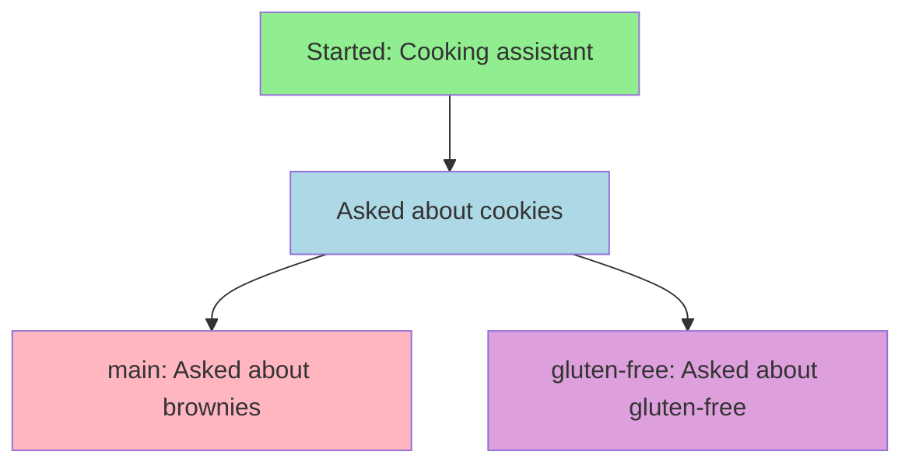

# Quickstart ⚡

**Time to complete:** 5 minutes  
**What you'll learn:** The essential GAIT commands to start being productive immediately!

Let's learn GAIT by doing! We'll create a conversation, make a mistake, fix it, and save important information. 🚀

## Your First GAIT Session 🎬

### Step 1: Create a Project Folder

```bash
mkdir ~/my-first-gait
cd ~/my-first-gait
```

Think of this folder as a "project" - like a notebook for one topic!

### Step 2: Initialize GAIT

```bash
gait init
```

```
✅ Initialized empty GAIT repository in /Users/you/my-first-gait/.gait
```

:::info What just happened?
GAIT created a hidden `.gait` folder. This is where all your conversation history lives! Think of it like a magical filing cabinet. 🗄️
:::

### Step 3: Start Chatting!

```bash
gait chat --model llama3.1
```

You'll see:
```
GAIT Interactive Chat (Ctrl+C or /exit to quit)
Branch: main | Model: llama3.1
> 
```

The `>` symbol means GAIT is ready for you to type! 💬

## The Essential Commands 🎮

Let's learn the magic commands by using them! Type each line after the `>` prompt:

### 1. 💬 Regular Chat (No Command)

```
> What are the three primary colors?

AI: The three primary colors are red, yellow, and blue...
```

**Just type normally to chat!** No special commands needed. 🙂

### 2. 📌 /pin - Remember This Forever!

Let's say the AI told you something SUPER important that you want it to always remember:

```
> Red, yellow, and blue are the primary colors for painting. Remember this!

AI: Got it! Red, yellow, and blue are the primary colors for mixing paint...

> /pin

✅ Pinned last turn to memory
```

:::tip What's happening?
The `/pin` command is like highlighting with a yellow marker! 🖍️ Now, even if you chat for hours, the AI will always remember that information because it's "pinned" to its memory.
:::

### 3. ⏪ /undo - Oops, That Was Wrong!

Sometimes AI makes mistakes. Let's fix one:

```
> What's 2+2?

AI: 2+2 equals 5

(This is wrong! Let's undo it)

> /undo

✅ Reverted to previous commit
```

Now it's like the AI never said "5"! The bad answer is completely gone. ✨

```
> What's 2+2?

AI: 2+2 equals 4

(Much better!)
```

### 4. 🌿 /branch - Create a Parallel Universe

Want to explore a different conversation path without losing your current one?

```
> /branch experiment

✅ Created branch 'experiment'
✅ Switched to branch 'experiment'

> Tell me about dogs

AI: Dogs are loyal, friendly animals...
```

Now you have TWO conversations:
- **main** - Your original conversation
- **experiment** - A new timeline where you asked about dogs

### 5. 🔄 /checkout - Switch Between Universes

```
> /checkout main

✅ Switched to branch 'main'
```

**Whoa!** The conversation about dogs disappeared! But don't worry - it's still saved in the `experiment` branch.

```
> /checkout experiment

✅ Switched to branch 'experiment'
```

And the dog conversation is back! 🐕

### 6. 📋 /memory - See What's Pinned

```
> /memory
```

```json
{
  "items": [
    {
      "turn_id": "abc123...",
      "note": "Primary colors for painting",
      "pinned_at": "2026-01-07T10:30:00"
    }
  ]
}
```

This shows everything you've pinned! Think of it like your AI's long-term memory bank. 🧠

### 7. 🚪 /exit - Leave the Chat

```
> /exit

Goodbye! 👋
```

Your conversation is **automatically saved**! You can come back anytime with:

```bash
gait chat --model llama3.1
```

And everything will still be there! 🎉

## Quick Command Cheat Sheet 📝

| Command | What It Does | When To Use It |
|---------|--------------|----------------|
| (just type) | Chat normally | All the time! |
| `/pin` | Save to permanent memory | When AI says something important |
| `/undo` | Delete the last Q&A | When AI makes a mistake |
| `/branch <name>` | Create new timeline | When you want to try something different |
| `/checkout <name>` | Switch timelines | When you want to go back to another branch |
| `/memory` | Show pinned items | When you want to see what's remembered |
| `/models` | List available models | When you want to see what AIs you can use |
| `/model <name>` | Switch to different AI | When you want to try a different model |
| `/exit` | Leave chat (saves automatically) | When you're done |

## Try This Practice Exercise! 🎯

Let's put it all together with a real scenario:

```bash
# 1. Start chat
gait chat --model llama3.1

# 2. Set up important context
> You are a helpful cooking assistant. Always give measurements in cups and tablespoons.
> /pin

# 3. Ask a question
> How do I make chocolate chip cookies?
(AI gives recipe)

# 4. Create experimental branch
> /branch gluten-free
> How do I make these cookies gluten-free?
(AI gives gluten-free version)

# 5. Go back to original
> /checkout main

# 6. Try a different question
> How do I make brownies?

# 7. See your memory
> /memory

# 8. Exit
> /exit
```

**Congratulations!** You just:
- ✅ Saved important context with `/pin`
- ✅ Created a branch with `/branch`
- ✅ Switched between branches with `/checkout`
- ✅ Viewed memory with `/memory`

## Understanding What Just Happened 🎓

### The Conversation Tree 🌳

Your conversation now looks like this:



- 🟢 **Green**: The pinned memory (always remembered)
- 🔵 **Blue**: Shared history (both branches have this)
- 🩷 **Pink**: Only in `main` branch
- 🟣 **Purple**: Only in `gluten-free` branch

### Your .gait Folder 📁

Behind the scenes, GAIT created this structure:

```
.gait/
├── objects/        (All saved conversations)
├── refs/
│   ├── heads/
│   │   ├── main           (Points to main timeline)
│   │   └── gluten-free    (Points to gluten-free timeline)
│   └── memory/
│       └── main           (Your pinned items)
└── turns.jsonl     (Quick lookup table)
```

You can actually look inside! Try:

```bash
cat .gait/refs/heads/main
```

You'll see a long code (a "hash") - that's the ID of your conversation!

## Common Beginner Questions ❓

### "When should I use /pin?"

📌 Pin when the AI says something you want it to **always remember**, like:
- Important rules ("Always use metric units")
- Project context ("I'm building a recipe app")
- Definitions ("In this project, 'user' means 'chef'")

### "When should I use /branch?"

🌿 Branch when you want to **try something different** without losing your current conversation:
- Testing different approaches ("What if I use React instead of Vue?")
- Comparing models ("How would GPT-4 answer this vs Llama?")
- Exploring ideas ("Let's try a different story ending")

### "Can I delete my .gait folder?"

⚠️ **Yes, but...** it will delete ALL your conversation history! It's like throwing away your notebook. Only do this if you want to start completely fresh.

### "How much space does GAIT use?"

💾 Very little! Text is tiny. Even 1000 conversation turns is usually less than 1MB. Your computer has space for millions of conversations!

## What's Next? 🗺️

Now you know the basics! Here's where to go next:

1. **[First Conversation Guide](first-conversation)** - Learn more about the chat interface
2. **[Key Concepts](key-concepts)** - Understand Turns, Commits, and Memory deeply
3. **[Interactive Chat Reference](../user-guide/interactive-chat)** - All chat commands explained

**Want to dive deeper right now?** Check out:
- 🧠 [Memory System Guide](../user-guide/memory-system) - Master the `/pin` command
- 🌳 [Branching & Merging](../user-guide/branching-merging) - Advanced branch techniques
- 🧪 [Recipes](../recipes/recovering-from-hallucinations) - Real-world scenarios

---

## The 5-Minute Challenge 🏆

**Can you do these tasks in 5 minutes?**

1. ✅ Create a new GAIT repository
2. ✅ Start a chat and ask about your favorite hobby
3. ✅ Pin an important fact
4. ✅ Create a branch called "explore"
5. ✅ Switch back to main
6. ✅ Check your memory with `/memory`
7. ✅ Exit and restart the chat (it should remember everything!)

**If you did it, you're ready to use GAIT for real work!** 🎉

---

:::tip Pro Tip 💡
Add this alias to your `~/.bashrc` or `~/.zshrc` for super-fast GAIT access:

```bash
alias g='gait'
alias gc='gait chat --model llama3.1'
```

Now you can just type `gc` to start chatting! 🚀
:::
