# Welcome to GAIT! 🎉

## What is GAIT? 🤔

Imagine you're building with LEGO blocks. Sometimes you build something cool, but then you add a weird piece that makes everything look wrong. With regular LEGO, you can just take that piece off and go back to when it looked good!

**GAIT does this for AI conversations!** 🤖✨

When you chat with an AI and it says something wrong (we call this a "hallucination" - like when someone imagines seeing something that isn't there), GAIT lets you press a magic "undo button" and go back to before the AI made that mistake.

## The Three Big Problems GAIT Solves 🎯

### 1. 🧹 The "Oops, That Was Wrong" Problem

**The Old Way:**
- You: "How do I make a sandwich?"
- AI: "You need to boil the bread for 20 minutes!" ❌ (This is WRONG!)
- You: "No, that's not right..."
- AI: *Now confused and keeps talking about boiling bread* 😵

**The GAIT Way:**
- You: "How do I make a sandwich?"
- AI: "You need to boil the bread for 20 minutes!" ❌
- You: `/undo` (magic command!)
- *The bad answer disappears like it never happened!* ✨
- You: "How do I make a sandwich?" (asking again)
- AI: "Put ingredients between two slices of bread!" ✅

### 2. 🧠 The "Remember This Forever" Problem

**The Old Way:**
- You teach the AI something important at the start
- You talk for a long time
- The AI forgets what you taught it (like when your brain is too full!)

**The GAIT Way:**
- You teach the AI something important
- You type `/pin` to "pin it to the AI's brain" 📌
- Even after talking for hours, the AI still remembers! 🎉

### 3. 🌳 The "What If I Tried This Instead?" Problem

**The Old Way:**
- You're writing a story with AI
- You wonder: "What if the hero went LEFT instead of RIGHT?"
- You'd have to start a whole new chat and copy everything 😰

**The GAIT Way:**
- You're writing a story with AI
- You type `/branch left-path` to create a "parallel universe" 🌌
- Now you have TWO stories: one where the hero goes RIGHT, one where they go LEFT!
- You can switch between them anytime! 🔄

## How It Works (The Simple Version) 📚

Think of GAIT like a **magical notebook** that:

1. **📝 Saves every page** - Every conversation turn gets saved
2. **🔖 Lets you bookmark pages** - Pin important things with `/pin`
3. **🌿 Lets you create alternate endings** - Branch into parallel stories with `/branch`
4. **⏪ Has an undo button** - Go back in time with `/undo`
5. **☁️ Syncs to the cloud** - Save your conversations to GaitHub (like GitHub for AI chats!)

## Real-World Example: Homework Helper 🎓

Let's say you're using AI to help with math homework:

```bash
# Start chatting with AI
gait chat --model llama3.1

You: "I need help with fractions"
AI: "Sure! Fractions are numbers that represent parts of a whole..."

# This is good info! Let's remember it forever
You: /pin

You: "What's 1/2 + 1/4?"
AI: "The answer is 3/4"

# Let's try a different problem on a new branch
You: /branch geometry-help

You: "Now help me with triangles instead"
AI: "Triangles have three sides..."

# Switch back to fractions
You: /checkout main

# The AI still remembers everything about fractions!
```

## Why "GAIT"? 🚶

**G**it for **A**I **T**urns

It's inspired by **Git** (the tool programmers use to save different versions of code), but for AI conversations!

- **Git** saves versions of code 💻
- **GAIT** saves versions of AI conversations 💬

## What's Next? 🗺️

Ready to get started? Here's your journey:

1. **[📦 Installation](getting-started/installation)** - Get GAIT on your computer
2. **[⚡ Quickstart](getting-started/quickstart)** - Your first 5 minutes with GAIT
3. **[💬 First Conversation](getting-started/first-conversation)** - Learn the magic commands
4. **[🧠 Key Concepts](getting-started/key-concepts)** - Understand Turns, Commits, and Memory

## GAIT in One Picture 🎨

```mermaid
graph LR
    A[👤 You type something] --> B[🤖 AI responds]
    B --> C[💾 GAIT saves it]
    C --> D{What do you do?}
    D -->|Keep chatting| A
    D -->|📌 Pin it| E[Saved to Memory Forever]
    D -->|⏪ Undo it| F[Go back in time]
    D -->|🌿 Branch it| G[Create alternate timeline]
```



## Need Help? 🆘

- 📖 Check the [User Guide](user-guide/interactive-chat)
- 🐛 Having issues? See [Troubleshooting](troubleshooting/common-issues)
- 💡 Want to understand how it works? Read [Architecture](architecture/overview)

---

**Let's build better AI conversations together!** 🚀✨
